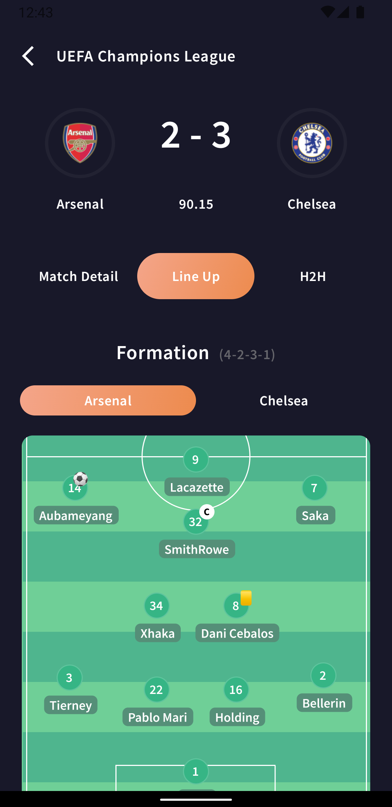
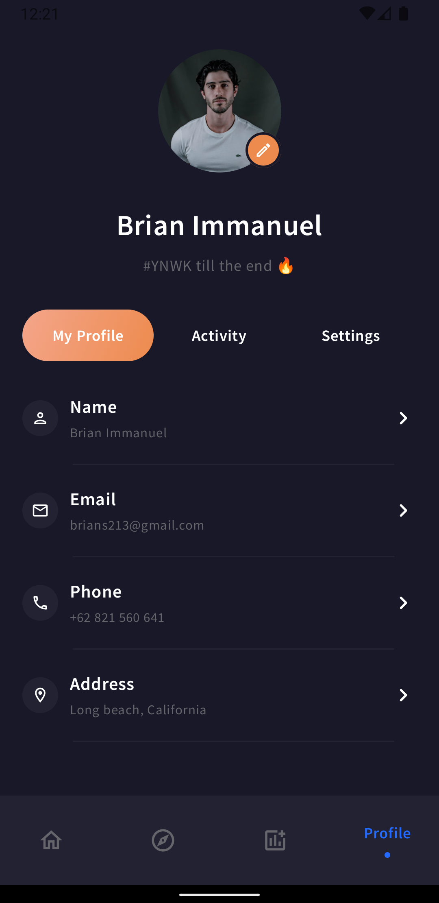
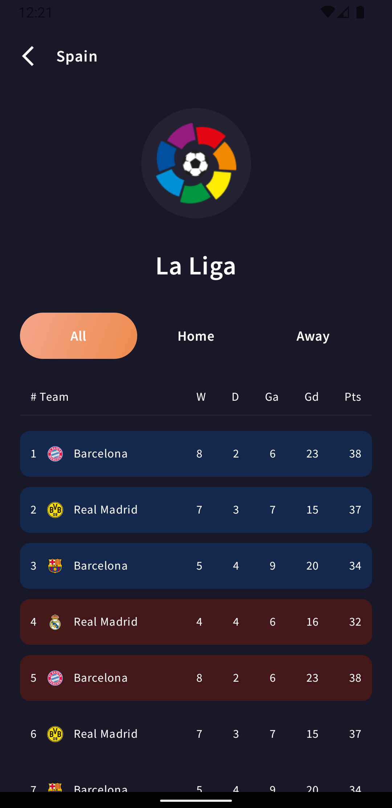

# ⚽️ LIVE SCORE UI KIT [Figma Source](https://www.figma.com/community/file/936495139689782604)

A Kotlin implementation.

 
Please star⭐ the repo if you like what you see😉.
 

 

## 📸 ScreenShots

| 1| 2|
|------|-------|
|||
|||
|||
|||
|||
|||

## 🤓 Author(s)
**Onuoha ifeanyi.** 
